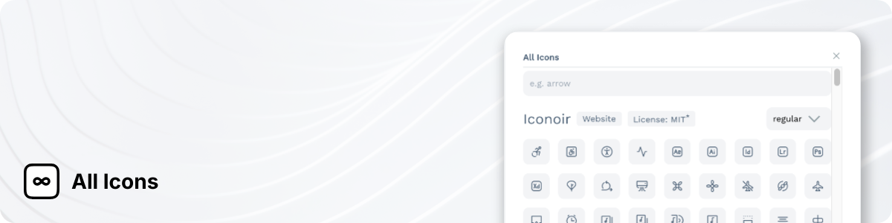

  

# All Icons

All Icons is a Penpot plugin that allows you to easily access icons from various icon libraries and add them to your project.

## Installation

> Penpot Plugins system is currently in development and not yet available in the live Penpot release.

1. Go to a Penpot project.
2. Open the plugin manager.
3. Fill the plugin URL input with `https://allicons.authormore.com/manifest.json`.
4. Click the "Install" button.
5. Follow the instructions on the screen.

   The installer will inform you about the permissions requested by the plugin:

   - Content's write access is necessary for the icon insertion.
   - Content's read access is necessary to save and retrieve the plugin's settings e.g. open icon sets, selected style variants.

6. Use the plugin manager to open the plugin.

## Development

You need to have an environment with Node.js installed to work on the plugin.

1. Clone the repository.
2. Run `npm ci` to install the dependencies.
3. Run `npm run generate-data` to generate the data for icon libraries.
4. Run `npm run dev` to start the server.
5. Open Penpot and go to the plugin manager.
6. Add a new plugin with the URL `http://localhost:4173/manifest.json`.
7. Use the plugin manager to open the plugin.

Currently the development setup is using the production build in watch mode. This means hot module replacement is not available and you need to reload the plugin manually after making changes.

## Credits

Readme image's background pattern by [Jean-Philippe Delberghe](https://unsplash.com/photos/a-close-up-of-a-white-wall-with-wavy-lines-75xPHEQBmvA).
